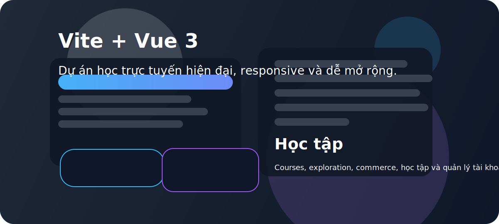

# Vite Vue Learning Platform



> Dự án Vue 3 + Vite cho ứng dụng học trực tuyến hiện đại và dễ mở rộng.

---

## 🌟 Tổng quan

Dự án này là một nền tảng học trực tuyến được xây dựng bằng:

- `Vue 3` với `<script setup>`
- `Vite` để phát triển nhanh và tải lại tức thì
- `Tailwind CSS` cho giao diện responsive
- `Pinia` để quản lý state nhẹ và rõ ràng
- `Vue Router` để điều hướng module
- `Axios` để gọi API

Ứng dụng gồm nhiều module chức năng:

- `auth`: đăng ký, đăng nhập, quản lý tài khoản
- `commerce`: trang khóa học, giỏ hàng, thanh toán
- `courses`: khóa học của người dùng
- `explore`: khám phá nội dung và AI
- `learning`: phòng học, video, slide, chat
- `system`: cài đặt người dùng
- `teacher`: quản lý giảng viên và khóa học

---

## 🚀 Chạy dự án

Trong thư mục dự án, chạy:

```bash
npm install
npm run dev
```

Mở trình duyệt tại:

```bash
http://localhost:5173
```

---

## 🧩 Cấu trúc thư mục chính

- `src/main.js` - entry point của ứng dụng
- `src/App.vue` - layout gốc
- `src/router/index.js` - cấu hình router chính
- `src/modules` - module chức năng theo domain
- `src/components` - component dùng chung
- `src/layouts` - header, footer và layout trang
- `src/stores` - store Pinia
- `src/services` - logic gọi API, service helper
- `src/utils` - helper và formatter

---

## ✨ Tính năng nổi bật

- Thiết kế module rõ ràng, dễ mở rộng
- Giao diện responsive và hiện đại
- Quản lý trạng thái bằng Pinia
- Tối ưu hiệu năng với Vite
- Dễ tích hợp backend, API và chức năng mới

---

## 🛠 Mở rộng

Bạn có thể phát triển thêm:

- Kết nối backend thực tế cho `auth` và `commerce`
- Thêm trang quản lý khóa học cho giáo viên
- Hoàn thiện tính năng phòng học trực tuyến
- Thêm kiểm thử và CI/CD
- Nâng cấp trải nghiệm mobile

---

## 📄 License

Dự án dùng `MIT License`.
