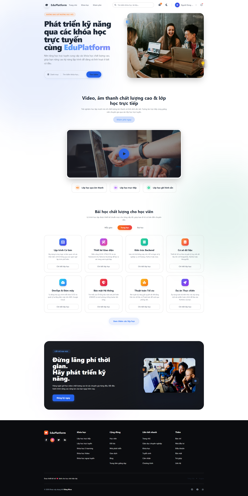
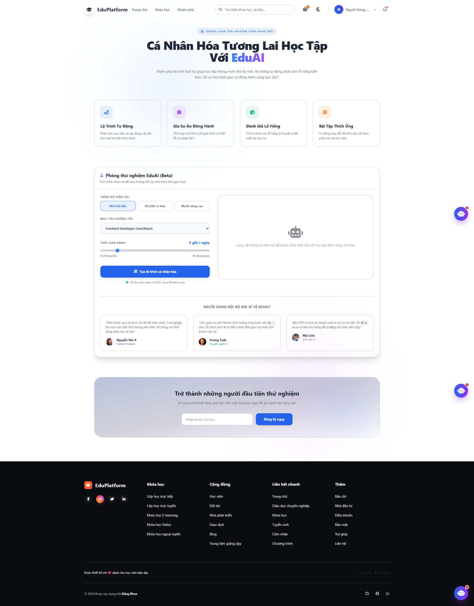
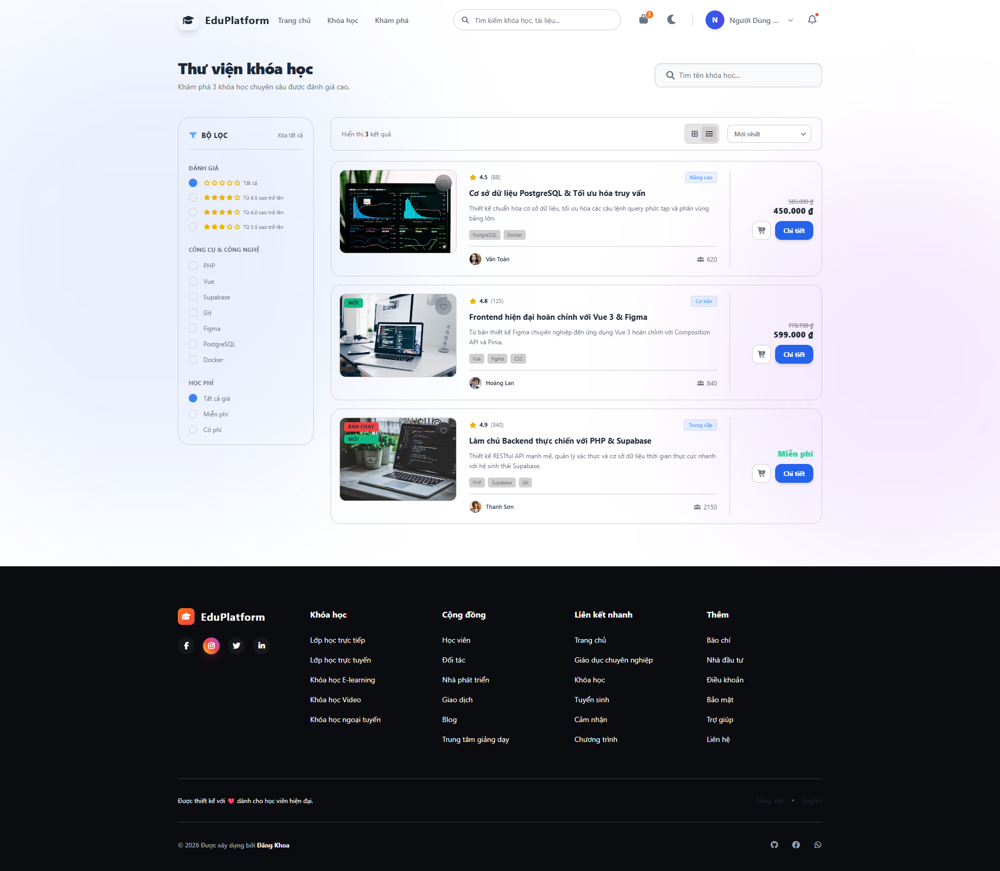
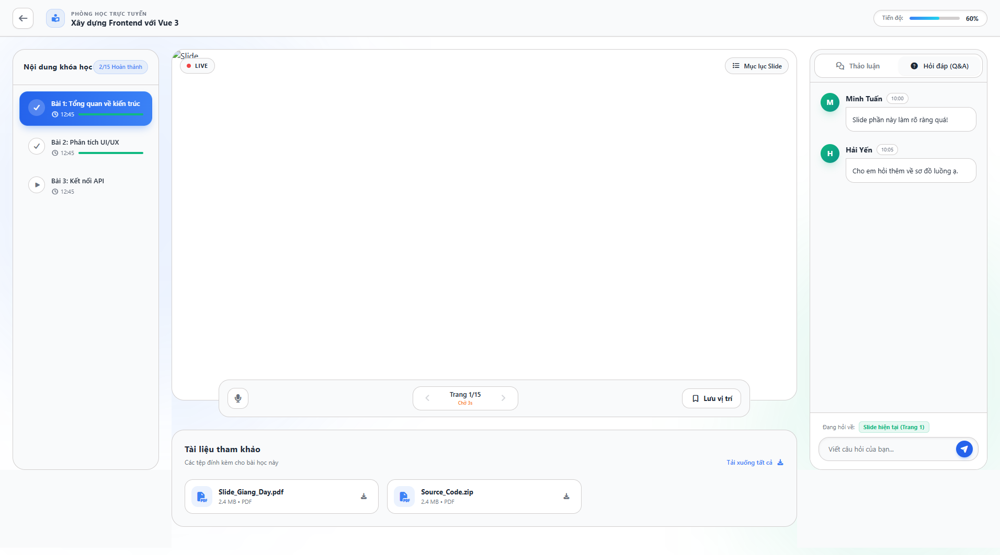
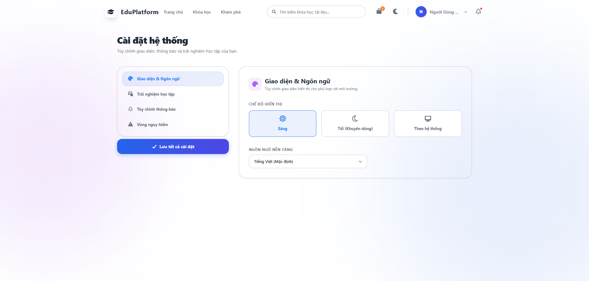

<div align="center">

# 🎓 EduPlatform

**Nền tảng Học trực tuyến Thế hệ mới**



[](#)
[](#)
[](#)

> _EduPlatform là một hệ sinh thái học tập trực tuyến toàn diện, kết hợp giữa nền tảng khóa học chất lượng cao và công nghệ Trí tuệ nhân tạo (EduAI). Dự án cung cấp trải nghiệm học tập cá nhân hóa, phòng học tương tác thời gian thực và các công cụ quản lý mạnh mẽ cho cả học viên và giảng viên._

</div>

---

## ✨ Tính năng nổi bật

Dự án được xây dựng theo kiến trúc **Modular**, chia thành các phân hệ rõ ràng nhằm tối ưu hóa việc quản lý và mở rộng:

### 🛒 Thương mại & Khám phá (Commerce & Explore)

- **Thư viện khóa học:** Tìm kiếm, lọc khóa học theo công nghệ (Vue, React, Node.js...), đánh giá và mức giá.
- **Chi tiết khóa học & Giảng viên:** Hiển thị lộ trình bài bản, thông tin mentor và các khóa học liên quan.
- **Giỏ hàng & Thanh toán:** Tích hợp quy trình thanh toán mượt mà.
- **🤖 EduAI (Phòng thử nghiệm):** Hệ thống tạo lộ trình tự động, đánh giá lỗ hổng kiến thức và gia sư ảo đồng hành 24/7 (Floating AI Chat).

### 📚 Trải nghiệm Học tập (Learning Space)

- **Phòng học trực tuyến (Study Room):** Tích hợp trình phát video, xem Slide bài giảng trực tiếp.
- **Tương tác thời gian thực:** Box Chat và Q&A ngay trong màn hình học tập.
- **Quản lý tiến độ:** Theo dõi phần trăm hoàn thành, danh sách bài học và tài liệu đính kèm (PDF, Source Code).
- **Khóa học của tôi:** Quản lý chứng chỉ, lộ trình học và tiếp tục bài học gần nhất.

### 👤 Quản lý Tài khoản & Hệ thống

- **Hồ sơ cá nhân (Portfolio):** Tùy chỉnh thông tin, kỹ năng chuyên môn (Tags) và liên kết mạng xã hội.
- **Trung tâm thông báo:** Quản lý hộp thư đến, nhắc nhở học tập, tương tác Q&A và khuyến mãi.
- **Cài đặt hệ thống:** Tùy chỉnh trải nghiệm học tập, hỗ trợ giao diện **Dark Mode / Light Mode** và đa ngôn ngữ.

### 👨‍🏫 Dành cho Giảng viên (Teacher Dashboard)

- **Course Builder:** Công cụ tạo và quản lý nội dung khóa học.
- **Analytics:** Phân tích báo cáo & Tương tác với học viên.
- **Sales:** Quản lý khuyến mãi và doanh thu.

---

## 🛠 Tech Stack

Hệ thống Frontend được thiết kế tối ưu hiệu suất với các công cụ hiện đại nhất:

| Phân loại               | Công nghệ sử dụng                                       |
| :---------------------- | :------------------------------------------------------ |
| ⚡ **Framework**        | **Vue 3** (Composition API)                             |
| 🚀 **Build Tool**       | **Vite** (Tối ưu tốc độ build & HMR)                    |
| 🛣️ **Routing**          | **Vue Router** (Module-based routing)                   |
| 📦 **State Management** | **Pinia** (Stores)                                      |
| 🎨 **Styling/UI**       | **Tailwind CSS**                                        |
| 🧩 **Khác**             | Tích hợp **Composables** (`useAuth`, `useColorMode`...) |

---

## 📁 Cấu trúc thư mục (Modular Architecture)

Dự án áp dụng cấu trúc thư mục theo hướng **Domain-Driven Design (DDD)**, giúp team dễ dàng scale up:

```text
src/
├── assets/          # Hình ảnh, icons (hero.png, vue.svg...)
├── components/      # UI Components dùng chung (Buttons, Dropdowns...)
├── composables/     # Shared logic (useAuth, useColorMode...)
├── layouts/         # Layout components (Header, Footer, Learning Layout)
├── modules/         # Các phân hệ tính năng cốt lõi (Domain modules)
│   ├── auth/        # Xác thực & Quản lý tài khoản bảo mật
│   ├── commerce/    # Thư viện khóa học, thanh toán, trang chủ
│   ├── courses/     # Quản lý khóa học của tôi, chứng chỉ
│   ├── explore/     # AI Playground, Khám phá
│   ├── learning/    # Phòng học (Video, Slide, ChatBox)
│   ├── system/      # Cài đặt hệ thống, Thông báo
│   └── teacher/     # Dashboard dành cho giảng viên
├── router/          # Cấu hình Router trung tâm (Index + ghép các module router)
├── services/        # Gọi API, cấu hình Axios/Fetch
├── stores/          # Global state management
├── types/           # Định nghĩa Type/Interface
└── utils/           # Helper functions (Formatters...)

```

---

## 🚀 Hướng dẫn cài đặt

Làm theo các bước sau để chạy dự án trên môi trường Local của bạn:

**1. Clone dự án**

```bash
git clone [https://github.com/dangkhoa2004/vite-project.git](https://github.com/dangkhoa2004/vite-project.git)
cd vite-project

```

**2. Cài đặt dependencies**
Bạn có thể sử dụng `npm` hoặc `yarn`:

```bash
npm install
# hoặc
yarn install

```

**3. Thiết lập cấu hình**

- Tạo file `.env` ở thư mục gốc.
- Sao chép nội dung từ `.env.example` (nếu có) và thiết lập các API endpoint cần thiết.

**4. Khởi chạy Server (Development mode)**

```bash
npm run dev
# hoặc
yarn dev

```

> 📍 Truy cập ứng dụng tại: `http://localhost:5173` hoặc `http://192.168.1234:5173/`

**5. Build cho Production**

```bash
npm run build

```

---

## 📸 Hình ảnh giao diện

<div align="center">

### Trang chủ


### Khám phá



### Khóa học



### Phòng học trực tuyến



### Cài đặt hệ thống (Dark/Light Mode)



</div>

---

## 👤 Tác giả

<div align="center">
  <a href="https://github.com/dangkhoa2004">
    
  </a>
  <h3>Cao Đăng Khoa</h3>
  <p>
    <a href="https://caodangkhoa.dev">🌐 Portfolio</a> •
    <a href="https://linkedin.com/in/dangkhoa2004">💼 LinkedIn</a> •
    <a href="https://github.com/dangkhoa2004">💻 GitHub</a>
  </p>
</div>
